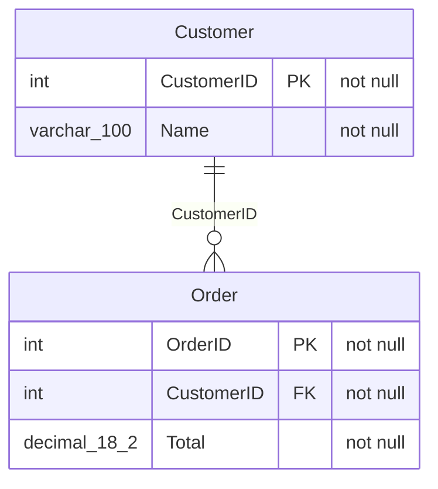

# xsltomermaid — Excel schema → Mermaid ER diagram

A small Qt (PySide6) desktop app: **drag an Excel file in, get a Mermaid entity-
relationship diagram of the database it describes.**

The app expects a spreadsheet where **each row defines one database column**, with
these headers (extra columns are ignored, order and casing are flexible):

```
SchemaName | TableName | ColumnOrder | ColumnName | DataType | Length | Precision |
Scale | IsNullable | IsIdentity | IsComputed | IsPrimaryKey | ForeignKeyReference |
DefaultValue | ComputedDefinition | Collation | Description
```

## What it does

1. **Drag & drop** (or browse to) an `.xlsx` / `.xlsm` file.
2. **Extracts** the rows and shows them in a table so you can confirm what was read.
3. **Groups** rows into tables and derives relationships from `ForeignKeyReference`.
4. **Generates** a Mermaid `erDiagram` with each table, its columns, `PK`/`FK`
   markers, and one relationship line per foreign key.
5. Lets you **copy** the Mermaid text, **save** it as `.mmd` or `.md`, or **preview**
   it rendered in your browser.

Foreign-key references are parsed flexibly — `dbo.Customer.CustomerID`,
`Customer.CustomerID`, `Customer(CustomerID)`, and a bare `Customer` all resolve to
the `Customer` table.

## Install

```bash
pip install -r requirements.txt
```

## Run

```bash
python main.py
```

Generate a sample workbook to try it out:

```bash
python make_sample.py   # writes sample_schema.xlsx
python main.py          # then drag sample_schema.xlsx onto the window
```

## Command line

You can also generate the diagram without the GUI:

```bash
python excel_to_mermaid.py sample_schema.xlsx
```

## Example output



> Note: Mermaid's ER parser only accepts a plain word for an attribute type, so
> `varchar(100)` / `decimal(18,2)` are flattened to `varchar_100` / `decimal_18_2`.

## Project layout

| File | Purpose |
|------|---------|
| `excel_to_mermaid.py` | Pure-Python core: read the sheet, build the schema model, emit Mermaid. No Qt required. |
| `main.py` | PySide6 GUI with drag-and-drop. |
| `make_sample.py` | Writes a small `sample_schema.xlsx` for testing. |
| `test_excel_to_mermaid.py` | Tests for the core (run `python test_excel_to_mermaid.py`). |

## Tests

```bash
python test_excel_to_mermaid.py
```
