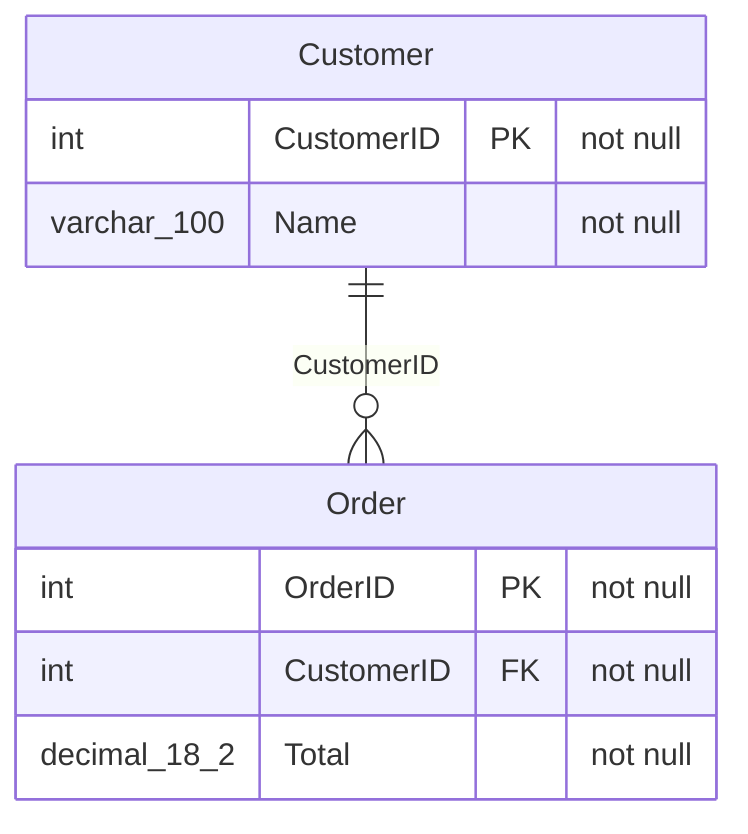

# xsltomermaid — Excel schema → Mermaid ER diagram

A small Qt (PySide6) desktop app: **drag an Excel file in, get a Mermaid entity-
relationship diagram of the database it describes.**

The app expects a spreadsheet where **each row defines one database column**, with
these headers (extra columns are ignored, order and casing are flexible):

```
SchemaName | TableName | ColumnOrder | ColumnName | DataType | Length | Precision |
Scale | IsNullable | IsIdentity | IsComputed | IsPrimaryKey | ForeignKeyReference |
DefaultValue | ComputedDefinition | Collation | Description
```

## What it does

1. **Drag & drop** (or browse to) an `.xlsx` / `.xlsm` file.
2. **Extracts** the rows and shows them in a table so you can confirm what was read.
3. **Groups** rows into tables and derives relationships from `ForeignKeyReference`.
4. **Generates** a Mermaid `erDiagram` with each table, its columns, `PK`/`FK`
   markers, and one relationship line per foreign key.
5. **Renders** the diagram live in-app (a "Rendered diagram" tab powered by a
   locally vendored `mermaid.js` — no internet needed).
6. Lets you **copy** the Mermaid text, **save** it as `.mmd` / `.md`, **export the
   diagram** from one export selector as `.drawio` / `.excalidraw` / `.pdf` /
   `.png` / `.svg`,
   **save/load selected tables** as `.toml` presets (including source filename),
   or **preview** it in your browser.
7. Uses **Left → Right** as the default rendered layout direction.
8. Shows **PK/FK markers** in the column selector, with column sorting by name or
   data type and a **PK, FK first** checkbox (primary keys, then foreign keys).
   These choices apply to each diagram table after **Render selected**.
   Click extracted-data column headers to sort ascending or descending.
9. Shows the diagram's **zoom percentage**; use **Ctrl+scroll** to zoom.
10. Includes a right-docked, copyable **SQL Server schema query** that produces the
    expected columns. It is **hidden by default**; open it via **View → T-SQL statement**.
11. **Help → Check for updates…** asks GitHub for the latest release and, if it's
    newer than the running version, offers to open its download page. The app
    makes no network calls unless you choose this. **Help → About** shows the
    running version.

Foreign-key references are parsed flexibly — `dbo.Customer.CustomerID`,
`Customer.CustomerID`, `Customer(CustomerID)`, and a bare `Customer` all resolve to
the `Customer` table.

## Install & run (uv)

This project uses [uv](https://docs.astral.sh/uv/). No manual venv needed — `uv`
creates and manages it from `pyproject.toml`/`uv.lock`.

```bash
uv sync            # install dependencies (incl. dev tools) into .venv
uv run xsltomermaid  # launch the GUI
```

Generate a sample workbook to try it out:

```bash
uv run xsltomermaid-sample  # writes sample_schema.xlsx
uv run xsltomermaid          # then drag sample_schema.xlsx onto the window
```

You can also pass a file to auto-load on startup:

```bash
uv run xsltomermaid sample_schema.xlsx
```

For a plain pip install, use `pip install .`. If you manage dependencies separately,
`pip install -r requirements.txt` installs the runtime dependencies without the CLI
entry points.

## Command line

Generate the diagram without the GUI:

```bash
uv run python -m xsltomermaid.excel_to_mermaid sample_schema.xlsx
```

## Screenshots (headless self-test)

The app can screenshot **itself** — handy for CI or verifying output without a
display. Both modes use Qt's offscreen platform, so no screen is needed.

Screenshot the **whole window** (data table + Mermaid source):

```bash
QT_QPA_PLATFORM=offscreen uv run xsltomermaid sample_schema.xlsx --screenshot window.png
```

Screenshot the **rendered ER diagram** itself (real boxes-and-arrows), as PNG or
SVG by extension:

```bash
QT_QPA_PLATFORM=offscreen uv run xsltomermaid sample_schema.xlsx --screenshot-diagram diagram.png
QT_QPA_PLATFORM=offscreen uv run xsltomermaid sample_schema.xlsx --screenshot-diagram diagram.svg
```

The diagram is rendered by the vendored `mermaid.js` in a headless `QWebEngineView`,
then the resulting `<svg>` is saved directly (SVG) or rasterised with QtSvg (PNG) —
this works offscreen where a plain window grab of web content would come back blank.

## Example output



> Note: Mermaid's ER parser only accepts a plain word for an attribute type, so
> `varchar(100)` / `decimal(18,2)` are flattened to `varchar_100` / `decimal_18_2`.

## Project layout

| File | Purpose |
|------|---------|
| `src/xsltomermaid/excel_to_mermaid.py` | Pure-Python core: read the sheet, build the schema model, emit Mermaid. No Qt required. |
| `src/xsltomermaid/main.py` | PySide6 GUI with drag-and-drop and the `--screenshot*` CLI modes. |
| `src/xsltomermaid/diagram_view.py` | Renders the Mermaid diagram in a `QWebEngineView` and exports it as SVG/PNG. |
| `src/xsltomermaid/services.py` | Application services for coordinating schema import workflows. |
| `src/xsltomermaid/updates.py` | Checks the GitHub API for a newer release (Help → Check for updates). |
| `src/xsltomermaid/__init__.py` | Holds `__version__`, the single source of the app version. |
| `src/xsltomermaid/assets/` | Packaged application icons. |
| `src/xsltomermaid/vendor/mermaid.min.js` | Locally bundled Mermaid (MIT) so rendering works offline. |
| `src/xsltomermaid/make_sample.py` | Writes a small `sample_schema.xlsx` for testing. |
| `tests/test_excel_to_mermaid.py` | Tests for the core (no Qt needed). |
| `tests/test_screenshot.py` | Headless tests — screenshots the window and the rendered diagram. |
| `pyproject.toml` / `uv.lock` | Package definition and locked dependencies. |

## Tests

```bash
QT_QPA_PLATFORM=offscreen uv run pytest
```

The core tests run without a display; the screenshot test runs Qt offscreen and
skips automatically if the GUI stack isn't importable.

## Package as a standalone executable

The app can be frozen into a self-contained executable (bundling Python, PySide6
incl. QtWebEngine, and the vendored `mermaid.js`) with
[PyInstaller](https://pyinstaller.org/), driven by `xsltomermaid.spec`:

```bash
uv sync                              # installs PyInstaller (dev group)
uv run pyinstaller xsltomermaid.spec --noconfirm
```

- **One-file (default):** produces a single `dist/xsltomermaid` (or
  `dist/xsltomermaid.exe` on Windows). Big (~230 MB) because Qt + Chromium are
  bundled, and slower to start.
- **One-dir:** set `XSLTOMERMAID_ONEFILE=0` to instead produce
  `dist/xsltomermaid/` containing the executable plus its libraries — faster to
  start and the most reliable option for QtWebEngine. Distribute the whole folder
  (zip it).

> **Build on the target OS.** PyInstaller does not cross-compile — build the
> Windows `.exe` on Windows, a macOS app on macOS, etc.

### Get a Windows `.exe` without a Windows machine

Two GitHub Actions workflows build the `.exe` on a Windows runner:

- **CI build** (`.github/workflows/build-windows.yml`) — runs on pushes to `main`
  / `claude/**` and on demand (**Actions** tab → "Build Windows exe" → *Run
  workflow*). It uploads the exe as a run **artifact** (`xsltomermaid-windows`),
  which requires a GitHub login and expires after 90 days.
- **Release** (`.github/workflows/release.yml`) — runs when you push a version tag
  and publishes the exe as a **GitHub Release** asset with a permanent, no-login
  download link. First set `__version__` in `src/xsltomermaid/__init__.py` to
  match the tag (`pyproject.toml` reads it from there, and the in-app update
  check compares against it), run `uv lock`, and merge that. Then:

  ```bash
  git tag v0.1.0
  git push origin v0.1.0
  ```

  The asset is named `xsltomermaid-v0.1.0.exe` and appears on the repo's
  **Releases** page.

## License

[MIT](LICENSE)
