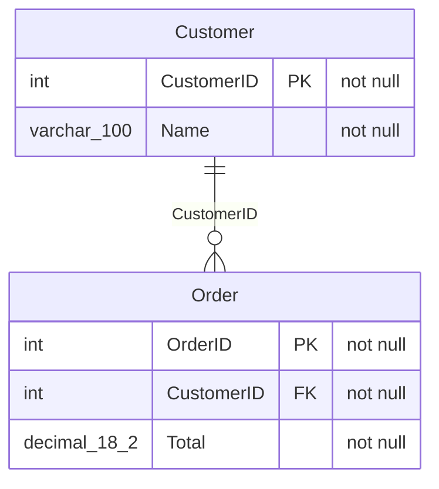

# xsltomermaid: Excel schema → ER diagram

A Windows/Linux/macOS desktop app (Qt / PySide6): **drag in a spreadsheet that
describes a database, get an entity-relationship diagram of it.** It renders
offline with a bundled Mermaid, copes with very large schemas (a 1,772-table
Dynamics 365 export can be explored as a map of clusters), and exports to Draw.io,
Excalidraw, PDF, PNG, SVG, Mermaid and T-SQL.

## Download

Get the latest Windows executable from the
[Releases page](https://github.com/damien-bafile/xsltomermaid/releases/latest):
`xsltomermaid-vX.Y.Z.exe` is a single file, with nothing to install. Inside the
app, **Help → Check for updates** tells you when a newer release is out.

To run from source on any platform, see [Install & run](#install--run-from-source).

## The input

One row per **database column**, with these headers (any order and case; extra
columns are ignored). Only `TableName` and `ColumnName` are required:

```
SchemaName | TableName | ColumnOrder | ColumnName | DataType | Length | Precision |
Scale | IsNullable | IsIdentity | IsComputed | IsPrimaryKey | ForeignKeyReference |
DefaultValue | ComputedDefinition | Collation | Description
```

Relationships come from `ForeignKeyReference`. All of these resolve to the
`Customer` table: `dbo.Customer.CustomerID`, `Customer.CustomerID`,
`Customer(CustomerID)`, `[dbo].[Customer].[CustomerID]` and a bare `Customer`.
Composite keys work too, written either as one reference per column or as
`dbo.OrderLine(OrderID, LineNo)`.

Using SQL Server? **View → T-SQL statement** shows a query that produces exactly
this export.

## How it works

1. **Drop** an `.xlsx` / `.xlsm` file on the window (or click to browse).
2. **Pick tables** in the list on the left. Small schemas are drawn straight
   away (up to 25 tables); for bigger ones, tick a few or open the
   [schema map](#big-schemas-the-schema-map) (Ctrl+M) and draw a cluster.
3. **Read the diagram** in the centre. It redraws a moment after you tick or
   untick tables or columns.
4. **Check the details** in the panel on the right: the selected table, the
   rows that were read, the column picker, the Mermaid source and a SQL query.
5. **Export** with the **Export** button, or copy the Mermaid or SQL.

## Features

### The workspace

- **The diagram is the centre of the window**, fitted to the view (enlarged up
  to 150% when small, scrolling below 85% so text stays readable (10 px or more)) and centred.
  The strip underneath shows the render status and **− / % / + / Fit** zoom
  controls. The percentage is the real on-screen scale. When you zoom or Fit
  below a readable size it says so, and picking a table in the list, map or
  Details panel goes back to a readable size centred on it.
- **Relationship labels can be moved and rotated** to clear tables they
  overlap: click one, drag it to move it, drag its round handle to rotate it
  around its centre (Shift snaps to 15°; the text never reads upside down,
  so vertical labels read bottom-to-top), double-click to reset. Changes are
  kept while the app runs, survive redraws, go into PNG/SVG/PDF exports, and
  **Diagram → Reset label layout** puts them all back.
- **Click a table** to select it: it's highlighted, and the table list scrolls
  to it. **Double-click** (or **Enter**) opens its Columns view. With the
  diagram focused, the **arrow keys** move between tables and **Esc** clears.
- **The options bar** has Orientation (Left → Right by default), Relationship
  labels and *Keys only*. **More** adds the theme, the canvas background (the
  view only; exports have their own), spacing, font size, fit to view, notes, a
  schema-name prefix, and *Hide audit and system links*. The app follows a
  light/dark switch while it's open.
- **Selections over 60 tables** don't redraw on every tick. They show *Out of
  date* until you press **Draw N tables** (F5), which turns blue while they wait. If Mermaid can't draw a
  diagram, its error message is shown on the canvas.

### Big schemas: the schema map

Every file opens on the diagram. For schemas over 25 tables the canvas points
at the **map**, and the **Diagram | Map** switch (Ctrl+M) changes view.

- **Every table is a point**, sized by its links and grouped into **clusters**
  of closely linked tables, each named after its most-connected table. On a
  1,772-table Dynamics export that gives clusters such as `msdyn_project`, `sla`,
  `systemuser`, `contact` and `account`.
- **Select** a cluster by clicking its name, a region by dragging, or single
  tables with Ctrl+click. The keyboard works too: arrows move, **Space**
  selects, **Enter** opens and **Ctrl+A** selects the cluster.
- **Draw N tables** turns the selection into the ER diagram. It replaces the
  ticks and can be undone.
- **Zoom in** (about 2.5× or more) and tables get their names beside them,
  busiest first and never overlapping; selected and ticked tables are named at
  any zoom.
- The table filter highlights matches on the map, ticked tables show as dashed
  rings, and tables with no links at all are listed underneath.
- **Save map image…** saves the whole map as a PNG (4,000 px on the long side)
  or SVG, with the cluster names sized to the image.
- A drawn diagram too big to fit at 85% opens centred on its most-connected
  table (its top, when the table is taller than the view), not the top-left
  corner.

### Dynamics 365 / Dataverse exports

- **Audit and system links are hidden automatically** when they make up more
  than 30% of all links (about 70% in a typical Dynamics export). These are
  `createdby`, `modifiedby`, the `owning…` columns, `organizationid` and
  `transactioncurrencyid`. It's one setting for the map, diagram, SQL and
  exports, and *Keys only* then leaves those columns out too. A chip under
  the diagram says so; click it to show them.
- **Dynamics system columns are hidden automatically** when they're over 20%
  of all columns (49% in a typical Dynamics export): bookkeeping columns
  (`importsequencenumber`, `overriddencreatedon`, time-zone and solution
  columns), the `…name` / `…yominame` copies of a lookup or choice, and
  `…_base` currency copies. Keys are always kept. They leave the diagram (each
  table says "+N system columns hidden") and the SQL, and are greyed in the
  Columns view;
  a chip under the diagram, or **More → Hide system columns**, shows them.
- **Wide tables:** drawing tables that average more than 50 columns switches
  *Keys only* on, with a chip under the diagram to turn it off. **Undo draw**
  turns it off too.
- **Keys only says what it left out:** each table ends with a
  "+N hidden by Keys only" row, and the Tables and Columns views count the
  columns actually drawn. A table with more than 12 key columns keeps its primary key and the
  foreign keys to tables in the diagram; the other foreign keys are counted in
  that row.
- **Solution-layering columns** (`overwritetime`, `componentstate`) aren't
  marked as primary keys.

### The table list

- Each row shows the table's links, **↗ out** and **↙ in** (audit and system
  links not counted), and a dot when the table is in the diagram.
- **Sort** by name, **Most connected**, or **By cluster** (the map's clusters,
  with a header for each).
- **Find** tables (Ctrl+F) by name or by a column they have. The search is fuzzy:
  letters in order match (`bkhdr` finds `bookingheader`, `acount` finds
  `account`), a word of three letters or more also matches column names (the
  column is shown beside the table), several words must all match, and the best
  matches come first. The map highlights the same tables.
- **Filter** by publisher **prefix** (`msdyn_`, `hsl_`, …),
  or use **Ticked only** and **Hide unconnected**.
- **Grow selection** (under the list) holds **Add related tables**, which ticks
  the neighbours of the ticked tables (choose the foreign-key direction), and
  the path tracer, which finds the shortest foreign-key route between two
  tables, optionally via a third.
- Under the list, **↗ / ↙** count the tables each table has foreign keys to and the tables
  with foreign keys to it, and **●** marks a table in the diagram.
- **Clear** and the bulk actions can be undone (**Undo**, or Ctrl+Z). The
  **Table list** menu saves and loads the ticked tables as `.toml` presets, with
  the column choices (left-out columns, dragged orders, the sort) and moved
  relationship labels. Older presets still load; they leave those as they are.

### The Details panel

Closed by default; open it with **Details**, **Ctrl+I**, or **Ctrl+1–6** for a
specific view. Columns and Links show the selected table; until one is
selected, they say how to pick one.

| View | What it shows |
|---|---|
| **Tables** | The tables in the diagram, with how many of their columns are drawn and their links (↗ out, ↙ in, counted like the table list). Click one to select it; **Columns ›** (or Enter) also opens its columns, Shift+Enter its links. |
| **Columns** | The selected table's columns, with their type, key (PK, FK) and whether they can be NULL. Tick to show or leave out; **Tick: All / None / Keys** for the table, which can be undone (the options bar's *Keys only* is different: it hides non-key columns in every table). The column order is shared by all tables: by name or type, optionally *PK, FK first*; drag rows (or Alt+Up / Alt+Down, or the arrow buttons) to give one table its own order, and picking a shared order for it asks first. Long types are cut so the names fit; the full type is in its tooltip. Columns that Keys only or Hide system columns leaves out are greyed and italic. Selecting a column tints its row blue, and clicking a row in the diagram selects that column here. |
| **Links** | Every table the selected one has foreign keys to or is targeted by foreign keys from, as *table · column*, each with **Add** (or Space), or ● when it's already in the diagram. The counts match the table list: audit and system links are folded into their own group, and a link from a table to itself is listed once, as "(itself)". *Also show tables linked through another table* adds the tables one more link away, grouped "through" the table between; their **Add** ticks both. A filter finds a table or column. Selecting a linked table glows it orange in the diagram (beside the selected table's blue) when it's drawn, and tints the rows the two tables join on; double-click or Enter moves to it. A table with no relationships says so. |
| **Mermaid** | The generated `erDiagram` source, syntax-coloured. |
| **SQL** | A syntax-coloured T-SQL `SELECT` over the diagram's tables, joined on their foreign keys (composite keys included). Choose the start table, `INNER` or `LEFT` joins and a `TOP (n)` limit. Names are bracketed only where T-SQL needs it (**Quote all names** brackets every one). For Dynamics data, **Latest version only** keeps each record's newest row in a Synapse Link or Fabric copy (by `versionnumber`, without `IsDelete` rows), and **Active records only** keeps `statecode = 0`, each applied per table where it fits. Anything that can't be a clean join (a second foreign key between the same tables, a self-reference, a table with no path) is written as a `--` comment. |
| **Data** | The rows read from the spreadsheet, sortable by column. Before a file loads, it explains the expected format. |

### Exporting

- **Export** saves Draw.io, Excalidraw, PDF, PNG or SVG. Its arrow picks the
  format (remembered), the **Background** (White by default, Transparent, or
  Match the view, so a dark on-screen diagram still exports ready for a white
  page) and the **PNG scale**.
- Save dialogs suggest the spreadsheet's name and remember the folder; the
  status line then offers **Show in folder**.
- **Mermaid** copies the source or saves it as `.mmd` / `.md`. **Preview in
  browser** opens the diagram in your browser, offline.

### Session and updates

- **File → Open Recent** lists the last 8 spreadsheets. The window layout,
  Details panel and diagram options come back next launch. Theme and
  background follow the OS light/dark mode.
- **Help → Spreadsheet format** (F1) describes the input, and **Help →
  Keyboard shortcuts** lists every key.
- **Help → Check for updates** asks GitHub for the latest release. The app
  makes no network calls unless you choose this.

## Keyboard shortcuts

| Keys | Action |
|---|---|
| Ctrl+O | Open a spreadsheet |
| Ctrl+F | Find tables (by name or column) |
| F5 · Ctrl+Enter | Draw the ticked tables now |
| Esc | Stop drawing · clear the diagram selection |
| Ctrl+Z | Undo the last change to the ticks |
| F1 | The spreadsheet format |
| Ctrl+M | Switch between diagram and map |
| Ctrl+I | Show or hide the Details panel |
| Ctrl+1 … Ctrl+6 | Details: Tables · Columns · Links · Mermaid · SQL · Data |
| Ctrl++ · Ctrl+- · Ctrl+0 | Zoom in · out · true 100% (until **Fit**) |
| Arrows · Enter | Move between tables · open one (diagram or map) |
| Ctrl+E | Export the diagram |
| Ctrl+Shift+C · Ctrl+Shift+Q | Copy Mermaid · copy SQL |
| Ctrl+S · Ctrl+L | Save as `.mmd` · load a table list |
| Ctrl+Q | Exit |

Most controls also have an Alt+letter mnemonic, shown underlined.

## Install & run from source

This project uses [uv](https://docs.astral.sh/uv/), which creates and manages
the virtual environment from `pyproject.toml` / `uv.lock`:

```bash
uv sync                      # install dependencies (incl. dev tools) into .venv
uv run xsltomermaid          # launch the GUI
uv run xsltomermaid-sample   # write sample_schema.xlsx to try it with
uv run xsltomermaid sample_schema.xlsx   # open a file on startup
```

With plain pip, use `pip install .`. `pip install -r requirements.txt` installs
only the runtime dependencies, without the command-line entry points.

## Command line and headless use

Print the Mermaid for a whole spreadsheet, without the GUI:

```bash
uv run python -m xsltomermaid.excel_to_mermaid sample_schema.xlsx
```

The app can also screenshot itself without a display (Qt's offscreen platform),
which is handy for CI:

```bash
# the whole window
uv run xsltomermaid sample_schema.xlsx --screenshot window.png
# just the rendered ER diagram, as PNG or SVG by extension
uv run xsltomermaid sample_schema.xlsx --screenshot-diagram diagram.svg
```

The diagram is drawn by the bundled `mermaid.js` in a headless
`QWebEngineView`; the resulting `<svg>` is saved directly, or rasterised with
QtSvg for PNG.

## Example output



> Mermaid's ER syntax only accepts a plain word for an attribute type, so
> `varchar(100)` and `decimal(18,2)` become `varchar_100` and `decimal_18_2`.

## Project layout

| File | Purpose |
|------|---------|
| `src/xsltomermaid/excel_to_mermaid.py` | The core: read the sheet, build the schema model, emit Mermaid. No Qt. |
| `src/xsltomermaid/schema_map.py` | Clusters and lays out a whole schema for the map. No Qt. |
| `src/xsltomermaid/sql_query.py` | Writes the T-SQL `SELECT … JOIN` for the SQL view. No Qt. |
| `src/xsltomermaid/selection_preset.py` | Reads and writes `.toml` table-list presets. No Qt. |
| `src/xsltomermaid/updates.py` | Checks the GitHub API for a newer release. No Qt. |
| `src/xsltomermaid/main.py` | The main window, which wires everything together, and the CLI modes. |
| `src/xsltomermaid/table_list.py` | The table list: filters, sorting, link counts, cluster headers. |
| `src/xsltomermaid/tables_view.py` | The Details panel's Tables view. |
| `src/xsltomermaid/column_selector.py` | The Details panel's Columns view. |
| `src/xsltomermaid/relationships_view.py` | The Details panel's Links view. |
| `src/xsltomermaid/options_bar.py` | The diagram options bar. |
| `src/xsltomermaid/map_view.py` | The schema map (`QGraphicsView`). |
| `src/xsltomermaid/highlight.py` | Syntax colouring for the SQL and Mermaid text (`QSyntaxHighlighter`). |
| `src/xsltomermaid/diagram_view.py` | Renders Mermaid in a `QWebEngineView`; SVG/PNG/PDF/Draw.io/Excalidraw export. |
| `src/xsltomermaid/widgets.py` | Small pieces: drop area, status line, render status, data model, workers. |
| `src/xsltomermaid/theme.py` | Colours, light/dark palettes, button styles, drawn status icons. |
| `src/xsltomermaid/config.py` | Limits, export formats and per-user settings (`QSettings`). |
| `src/xsltomermaid/services.py` | Coordinates loading a workbook into a schema. |
| `src/xsltomermaid/make_sample.py` | Writes the sample workbook. |
| `src/xsltomermaid/__init__.py` | `__version__`, the single source of the app version. |
| `src/xsltomermaid/vendor/mermaid.min.js` | Bundled Mermaid (MIT), so rendering works offline. |
| `src/xsltomermaid/assets/` | Application icons. |
| `tests/` | Core, map, SQL, preset and update tests (no display needed), plus headless GUI tests in `test_screenshot.py`. |
| `xsltomermaid.spec` | PyInstaller build definition. |

## Tests

```bash
QT_QPA_PLATFORM=offscreen uv run pytest
```

The GUI tests run Qt offscreen and skip automatically if the GUI stack isn't
available. CI runs the full suite on pushes to `main` and on every pull request.

## Building the executable

The app freezes into a self-contained executable (Python, PySide6 with
QtWebEngine, and the bundled `mermaid.js`) with
[PyInstaller](https://pyinstaller.org/):

```bash
uv sync                                       # installs PyInstaller (dev group)
uv run pyinstaller xsltomermaid.spec --noconfirm
```

- **One-file (default):** a single `dist/xsltomermaid(.exe)`, about 210 MB
  because Qt and Chromium are bundled, and slower to start.
- **One-dir:** set `XSLTOMERMAID_ONEFILE=0` for a `dist/xsltomermaid/` folder
  with the executable and its libraries. It starts faster and is the most
  reliable option for QtWebEngine; distribute the whole folder.

PyInstaller doesn't cross-compile, so build on the target OS. Two GitHub
Actions workflows build the Windows `.exe` on a Windows runner:

- **Build Windows exe** (`.github/workflows/build-windows.yml`) runs on pushes to
  `main` and on demand, and uploads the exe as a run artifact (login required,
  expires after 90 days).
- **Release** (`.github/workflows/release.yml`) runs when a version tag is
  pushed and publishes the exe as a GitHub Release, with release notes.

### Releasing a version

1. Set `__version__` in `src/xsltomermaid/__init__.py` (for example `0.15.0`).
   `pyproject.toml` reads it from there, and the in-app update check compares
   against it. Merge that change to `main`.
2. Tag the merged commit and push the tag:

   ```bash
   git tag -a v0.15.0 -m "v0.15.0"
   git push origin v0.15.0
   ```

   The Release workflow builds, smoke-tests and publishes
   `xsltomermaid-v0.15.0.exe`.

## License

[MIT](LICENSE)
